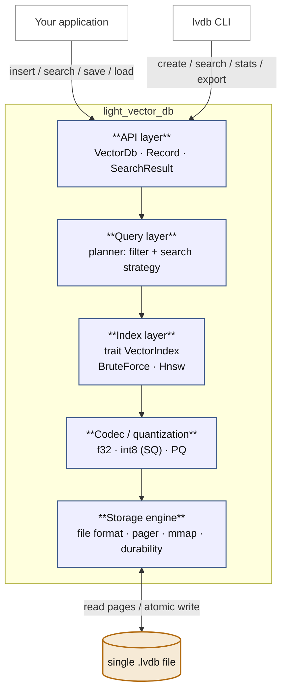
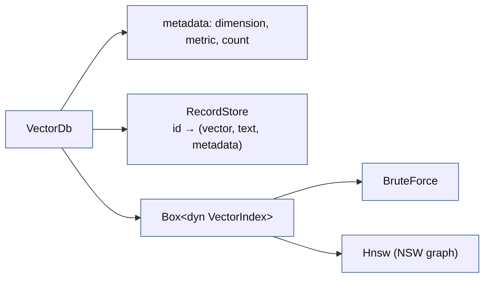
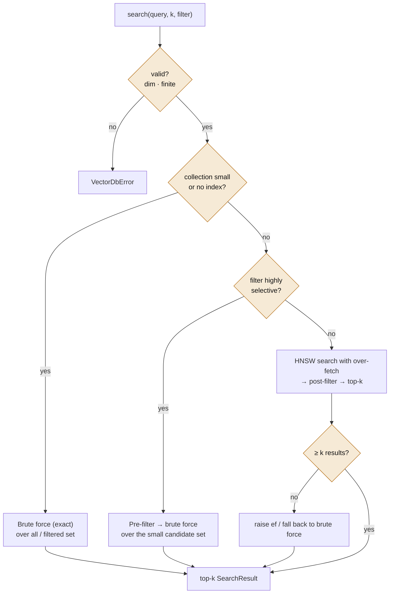
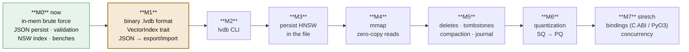

# light_vector_db — Architecture

> **Vision.** An embedded, file-based vector database — *SQLite for vectors*.
> One dependency-light Rust crate, one portable file you can commit, share, and
> open anywhere. Bring your own embeddings; we validate, store, index, persist,
> and search them.
>
> **Non-goal.** We do not generate embeddings, run a server, or require a C
> toolchain. Simplicity is on the *outside*; the depth is under the hood.

This document is the design we build against. It is deliberately ambitious: the
public API stays small and boring, while the storage engine, the persisted
index, memory-mapping, and quantization are where the real engineering lives —
exactly the shape of SQLite itself.

---

## 1. Design principles

1. **Embedded & single-file.** No server, no config. The database *is* a file.
2. **Portable & versioned.** A file written today opens years from now. The
   on-disk format has a magic header and a version, and we never break old
   readers within a major version.
3. **Pure Rust, dependency-light.** Every dependency is a deliberate decision
   (§8). `cargo add light_vector_db` and go — no build tooling.
4. **Bring your own vectors.** The app supplies `Vec<f32>` from any model. That
   keeps us small and model-independent.
5. **Human-inspectable.** A binary primary format for speed, plus a JSON
   import/export bridge so you can read a database in a text editor. (A real
   differentiator vs. opaque formats.)
6. **Exact by default, approximate on demand.** Small collections use exact
   brute force; large ones opt into the HNSW index. Correctness first, scale
   when asked.

---

## 2. Layered architecture

The crate is a stack of layers, each depending only on the one below it. This is
what keeps an ambitious engine from turning into a tangle.



| Layer | Responsibility | Today | Planned |
|---|---|---|---|
| **API** | Public, stable surface apps call. | `VectorDb`, `Record`, `SearchResult`, `VectorDbError` | `Collection`, streaming iterators |
| **Query** | Decide *how* to answer a search: filter strategy, index vs. brute force, scoring, limit. | `search_filtered` routes unfiltered queries to the index; keeps filtered search exact | full planner (§5) |
| **Index** | Nearest-neighbour lookup behind one trait. | `VectorIndex` trait with `BruteForce` + `AnnIndex`; `VectorDb` holds a `Box<dyn VectorIndex>` chosen via `IndexKind` | per-layer HNSW, persisted index |
| **Codec** | How a vector is encoded in bytes. | raw `f32` via serde | `f32`, scalar-quantized `int8`, product quantization |
| **Storage** | The on-disk format, I/O, mmap, durability. | JSON via `save/load_to_path` | binary `.lvdb` format, pager, mmap (§4) |

**Key refactor:** today `VectorDb` owns everything. We split index behind a
trait so brute force and HNSW are interchangeable, and split storage so the
format is independent of the in-memory model.

```rust
/// Every index kind implements this. The query layer talks only to the trait.
pub trait VectorIndex {
    fn insert(&mut self, id: u64, vector: &[f32]) -> Result<(), VectorDbError>;
    fn search(&self, query: &[f32], k: usize, ef: usize) -> Vec<(u64, f32)>;
    fn remove(&mut self, id: u64) -> bool;
}
```

`AnnIndex` from `src/ann.rs` becomes the `Hnsw` implementation; a thin
`BruteForce` wraps the current linear scan. The planner picks between them.

---

## 3. In-memory model



- **RecordStore** owns the payloads (vector, text, metadata) keyed by `u64` id —
  essentially today's `BTreeMap<u64, Record>`.
- **The index** owns only *ids + geometry*, never the payloads. It returns
  `(id, score)`; the store resolves ids to full `Record`s. This separation is
  what lets us persist and mmap the two independently.

---

## 4. The `.lvdb` file format

The heart of the project. A single file, little-endian, page-aligned, designed
to be **memory-mapped** so a multi-GB database opens without loading multi-GB
into RAM (SQLite's core trick).

```
 ┌──────────────────────────────────────────────────────────┐
 │ HEADER  (fixed 128 bytes, page 0)                          │
 │   magic      "LVDB\0"          5 B                         │
 │   format_ver u16               major.minor                │
 │   flags      u16               dirty, has_index, …        │
 │   page_size  u32               e.g. 4096                   │
 │   dimension  u32                                          │
 │   metric     u8                cosine | dot | l2           │
 │   encoding   u8                f32 | int8_sq | pq          │
 │   count      u64               live records               │
 │   § offsets  u64 × N           records/payload/index/free │
 │   header_crc u32               integrity of the header    │
 ├──────────────────────────────────────────────────────────┤
 │ VECTORS section     (page-aligned, fixed stride)          │
 │   [v0][v1][v2]…      contiguous, mmap as a matrix         │
 ├──────────────────────────────────────────────────────────┤
 │ PAYLOAD section     (variable length)                     │
 │   offset table  +  text + metadata blobs                  │
 ├──────────────────────────────────────────────────────────┤
 │ INDEX section       (present iff has_index)                │
 │   HNSW: params, entry point, per-layer neighbour lists    │
 ├──────────────────────────────────────────────────────────┤
 │ FREELIST / TOMBSTONES  (space reclaimable by `compact`)   │
 └──────────────────────────────────────────────────────────┘
```

**Why this shape:**

- **Fixed-stride vectors** → the whole vectors section maps as one flat matrix;
  reading vector *i* is pointer arithmetic, zero-copy, no deserialization.
- **Payloads separate** → variable-length text/metadata never disturb the
  vector matrix's alignment.
- **Index embedded** → load is *instant*: we read the graph, we don't rebuild
  it. **This is where the HNSW work you already wrote earns its place.**
- **Offsets + freelist** → deletes tombstone, and `compact` reclaims — updates
  don't force a full rewrite forever.

**Durability.** v1 keeps today's *write-temp-then-atomic-rename* (crash never
corrupts the existing file). A later milestone adds a journal for safe in-place
page writes.

**Portability.** Endianness and layout are fixed and documented, so a file
written on your Windows box opens identically on a colleague's Mac or in CI.

**JSON bridge.** JSON stops being the primary format and becomes
`export`/`import`: the human-readable, diffable, version-controllable
representation for fixtures and inspection.

---

## 5. Query layer — the planner

A search is `search(query, k, filter)`. Answering it *well* is a real problem,
especially the **filtered-ANN** case: naively post-filtering an approximate
search can return too few results (the "filter recall cliff"). The planner
chooses a strategy:



The rules of thumb (thresholds are tunable and benchmark-driven):

- **Small or unindexed** → brute force. Exact, simple, and *faster* than a graph
  walk below a few thousand vectors.
- **Selective filter** → pre-filter to candidates, then brute force them. Avoids
  the ANN-over-filter cliff entirely.
- **Broad/no filter, large collection** → HNSW with over-fetch, post-filter,
  widen `ef` or fall back if short.

---

## 6. Module layout

```
src/
  lib.rs            # re-exports, crate docs, public API surface
  error.rs          # VectorDbError
  record.rs         # Record, Metadata, SearchResult
  db.rs             # VectorDb / Collection: orchestration
  query/
    mod.rs          # planner: strategy selection
    scan.rs         # scoring, top-k selection
  index/
    mod.rs          # trait VectorIndex
    brute_force.rs  # exact linear scan
    hnsw.rs         # from today's src/ann.rs (NSW → HNSW)
  storage/
    mod.rs
    format.rs       # header + section layout, versioning, crc
    pager.rs        # file I/O, mmap, atomic write, freelist
    codec.rs        # vector encoding on disk
  quantize.rs       # scalar + product quantization
  bin/
    lvdb.rs         # the CLI
benches/            # insert / search benchmarks (existing scaffold)
tests/              # integration tests (existing validation.rs)
docs/               # this file + the ANN/HNSW guide
```

---

## 7. The `lvdb` CLI — the `sqlite3` shell

What turns "a library with save/load" into "a tool you use anywhere while
testing." Every command operates on one file.

| Command | Purpose |
|---|---|
| `lvdb create <file> --dim N --metric cosine` | Make an empty database. |
| `lvdb insert <file> --id 1 --vector @vec.json --text "…" --meta topic=rust` | Add a record (vector from arg, file, or stdin). |
| `lvdb search <file> --vector @q.json -k 10 --filter topic=rust` | Query; prints ranked hits. |
| `lvdb stats <file>` | Count, dimension, metric, index type, layers, file size. |
| `lvdb export <file> out.json` / `lvdb import in.json <file>` | The human-readable bridge. |
| `lvdb compact <file>` | Reclaim tombstoned space. |
| `lvdb bench <file>` | Insert/search timings (reuses the bench scaffold). |

---

## 8. Dependency decisions *(need your sign-off)*

The "dependency-light" value is in tension with some milestones. Each of these
is a real choice — I'll flag them, not add them silently:

| Need | Minimal option | Trade-off |
|---|---|---|
| Memory-mapping | `memmap2` | Tiny, ubiquitous, essentially the standard. Hard to avoid for real mmap. **Recommend adding at M4.** |
| Header checksum | hand-rolled CRC32, or `crc32fast` | Hand-roll keeps zero deps; `crc32fast` is faster. **Recommend hand-roll first.** |
| CLI arg parsing | hand-rolled, or `clap` | `clap` is ergonomic but heavy; a hand-rolled parser keeps the "zero deps" story. **Recommend hand-roll for v1.** |
| Binary (de)serialization | hand-rolled `byteorder`-style, or a crate | Hand-rolling the format teaches the most and keeps deps at zero. **Recommend hand-roll — it's the point.** |

Net: we can reach M3 with **zero new dependencies**, and only genuinely need
`memmap2` at M4. That preserves the crate's identity.

---

## 9. Roadmap — the depth ladder

Each milestone is shippable and non-throwaway; later ones build on earlier.



- **M0 — foundations (have / in progress).** In-memory brute force, JSON
  persistence with atomic writes, validation, the NSW index first slice, and a
  benchmark scaffold.
- **M1 — the index seam + the file format.** Delivered in slices:
  - [x] Slice 1 — `VectorIndex` trait; `BruteForce` + `AnnIndex` behind it.
  - [x] Slice 2 — `VectorDb` holds a `Box<dyn VectorIndex>` chosen by `IndexKind`;
    unfiltered search routes through it; index maintained on insert/upsert/delete
    and rebuilt on load; `index_kind` persisted in the JSON snapshot.
  - [ ] Slice 3 — the binary `.lvdb` v1 format (header + vectors + payload sections).
  - [ ] Slice 4 — demote JSON to `export`/`import`.

  *Zero new deps through slice 3.*
- **M2 — the CLI.** `lvdb` with the commands in §7. Makes it demoable and real.
- **M3 — persist the index.** Serialize the HNSW graph into the index section so
  loading a large database is instant. *The ANN work pays off here.*
- **M4 — mmap.** Zero-copy vector reads; open huge files in small RAM. (`memmap2`.)
- **M5 — mutability at scale.** Tombstoned deletes, `compact`, and a journal for
  safe in-place writes.
- **M6 — quantization.** Scalar quantization (4× smaller), then product
  quantization (8–32×).
- **M7 — reach.** A C ABI / PyO3 bindings so non-Rust apps embed it; a
  single-writer/multi-reader concurrency story.

---

## 10. Open questions *(your call)*

1. **One collection per file, or many?** SQLite has many tables per file. v1
   recommendation: **one collection per file** ("share a file = share a
   dataset"); revisit multi-collection ("tables") later.
2. **Binary primary + JSON export** — agreed direction, or keep JSON primary for
   longer?
3. **Metrics beyond cosine** (dot product, L2)? Cheap to store in the header
   now; recommend adding the enum even if only cosine is implemented at first.
4. **Crate/CLI split** — CLI as `src/bin/lvdb.rs` in this crate, or a separate
   `lvdb-cli` crate later?
5. **How far do you want to go?** M1–M3 already make this a serious,
   portfolio-grade project. M4–M7 make it genuinely competitive with real
   embedded vector stores.

---

*Companion reading: [`docs/ann-hnsw-guide.md`](ann-hnsw-guide.md) explains the
index algorithm this architecture persists and memory-maps.*
