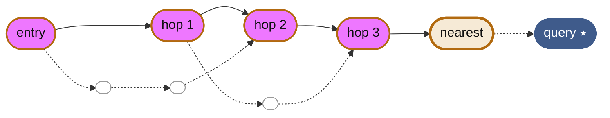
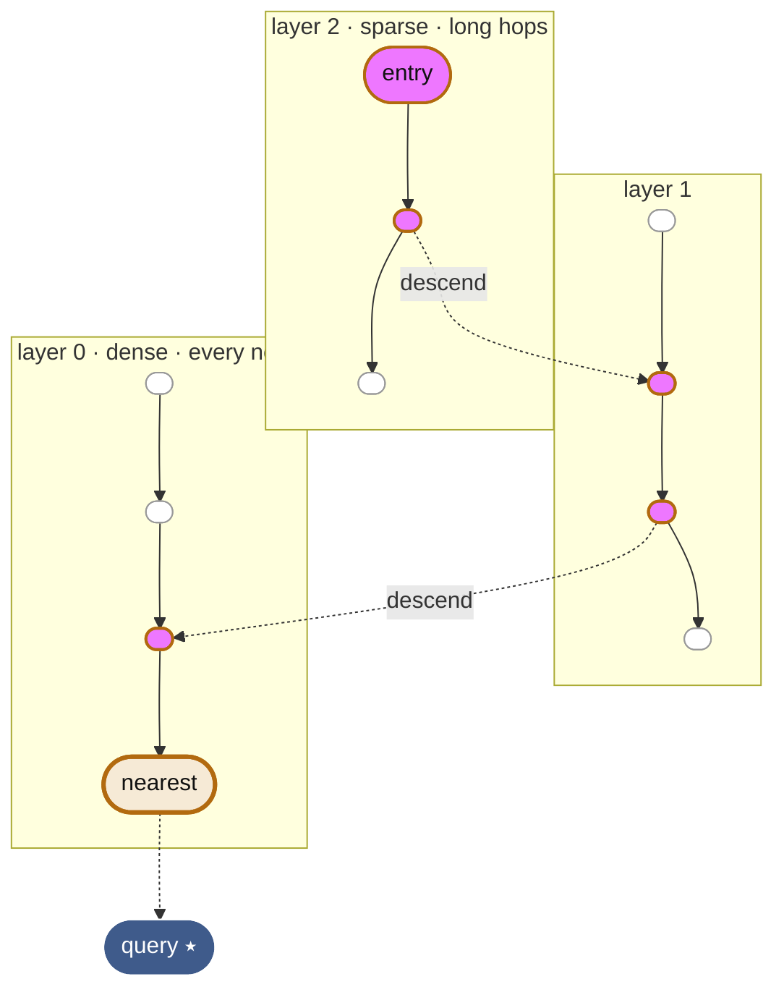

# Navigating Vector Space — ANN, NSW & HNSW

A learning guide for the approximate nearest-neighbour work in this crate.
Every concept below maps to code you already have in
[`src/ann.rs`](../src/ann.rs) and [`src/lib.rs`](../src/lib.rs).

Read it top to bottom with the code open beside you.

---

## 1. The problem: comparing against everything

A vector database stores **embeddings** — lists of numbers like
`[0.12, -0.5, 0.9, …]` that place each item as a point in high-dimensional
space. "Find the most similar item" means "find the nearest point to my query."

The obvious way — how `VectorDb::search` works today — is to measure the query
against **every** stored vector and keep the best.

- It is **exact**: it always returns the true nearest neighbours.
- It is **O(n · d)** per query: double the records, double the work.

At a few thousand vectors that is instant. At ten million it is a problem.

The fix is to stop comparing against everything and instead **walk a graph**
toward the answer — touching only a handful of points along the way. That is
what "approximate" buys you: you trade a guarantee for sub-linear speed.

---

## 2. The bargain: recall for speed

An **approximate nearest-neighbour (ANN)** index gives up the promise of always
being exactly right. Instead of "the true 10 nearest," it returns "10 that are
almost certainly among the nearest." The quality of that "almost" is **recall**.

- **Recall@k** — of the `k` results you return, what fraction are in the *true*
  top-`k` that brute force would find? Recall@10 = 0.98 means 98 of every 100
  returned results were genuinely correct.
- ANN indexes let you **dial recall up or down**. Explore more of the graph and
  recall climbs toward 1.0 while speed drops. Explore less and you go faster
  with more misses.
- The win: on large collections you hold recall near **0.95–0.99** while doing a
  tiny fraction of brute force's work.

> **Map to your code.** Your `matches_brute_force_top1_with_high_ef` test is a
> recall check in disguise. Setting `ef_search = count` forces the walk to
> explore the whole graph, so recall becomes 1.0 and the ANN result must equal
> brute force. Lower that `ef` and you are trading recall for speed.

---

## 3. NSW: the graph you walk

A **Navigable Small World (NSW)** graph is what your `AnnIndex` builds:

- Each record is a **node**.
- Each node keeps edges to a handful of its nearest **neighbours**.
- Because neighbours are found *during* insertion, when the graph is still
  sparse, some edges reach clear across the space. Those accidental long-range
  links are the "small world" magic — they let a search cross the whole space in
  a few hops (think "six degrees of separation").

**Greedy search** is the walk: start at an entry node, look at its neighbours,
jump to whichever is most similar to the query, and repeat — always moving
closer — until no neighbour improves on where you stand. To avoid getting stuck
in a bad local pocket, you keep not just the single best node but a small
*frontier* of the best candidates seen so far. The size of that frontier is `ef`.

*Each hop jumps to the neighbour most similar to the query. A long-range edge
near the start covers most of the distance at once; short edges near the end
refine. The walk touches five nodes, not the whole graph.*

> **Map to your code — `search_layer`.** Your `search_layer` is exactly this
> walk, made robust with two heaps:
>
> - **`to_explore`** is a *max-heap*: `pop()` always hands you the most-similar
>   candidate to expand next — the "jump to the best neighbour" step.
> - **`results`** is a *min-heap* (via `Reverse`) holding the best `ef` nodes so
>   far, with the **weakest on top** so it is cheap to evict once you exceed `ef`.
> - The loop stops when the best remaining candidate cannot beat the worst kept
>   result (`current.similarity < worst`) — the frontier cannot improve.
> - The `entry` node is simply your first inserted record.

---

## 4. HNSW: add layers, like a skip list

Plain NSW has one weakness: the *first* hops from a random entry node can be slow
when the graph is huge. **HNSW — Hierarchical NSW** — fixes this by stacking
several NSW graphs into layers, borrowing the trick of a **skip list**.

- The **top layer** holds only a few nodes with long edges: a sparse "express
  map" for covering ground fast.
- Each layer below is **denser** and more local.
- A search starts at the top, greedily walks to the closest node it can reach,
  then **drops down** to the same node in the next layer and continues — coarse
  navigation up top, fine-grained precision at the bottom.
- Each node's top layer is chosen **randomly** (an exponential distribution),
  which is why most nodes live only on layer 0 and a rare few reach the top.

*HNSW is your NSW walk, repeated per layer. The sparse top layer jumps most of
the way in one hop; each `descend` re-enters the same greedy search on a denser
layer. Only layer 0 contains every node — the upper layers exist purely to find
a great starting point fast.*

> **What your code is — and isn't — yet.** Your `AnnIndex` is a faithful, correct
> **single layer**: it is HNSW's layer 0. To grow it into full HNSW you'd add:
>
> 1. a random **top-layer assignment** per node at insert time,
> 2. per-layer neighbour lists,
> 3. a search that starts at the top entry point and **descends** layer by
>    layer, reusing your existing `search_layer` at each level.
>
> The hard part — greedy routing with the two heaps — you have already written.

---

## 5. The three knobs

Every graph ANN index exposes the same trade-offs. In your code these are the
fields of `AnnParams`.

| Knob (your field) | HNSW name | What it controls | Turn it up → |
|---|---|---|---|
| `max_neighbors` | `M` | Edges kept per node. More edges = more routes, richer graph, bigger memory. | Higher recall & more RAM; slower build. |
| `ef_construction` | `efConstruction` | How hard insertion searches for good neighbours. Sets graph *quality*. | Better graph & higher recall; slower **build** only. |
| `ef_search` | `ef` / `efSearch` | Frontier width at query time — how much of the graph a search explores. | Higher recall; slower **queries**. Tune per query. |

`ef_construction` is a one-time build cost; `ef_search` you can change on every
call (that's why you exposed `search_with_ef`). Usual recipe: pick `M` in the
8–48 range, build once with a generous `ef_construction`, then tune `ef_search`
until recall hits your target.

---

## 6. Do this to make it click

Reading only gets you so far — the intuition lands when you watch the numbers
move in your own index. Roughly easiest first:

1. **Measure recall, don't assume it.** Write a helper that runs the same queries
   through both `VectorDb::search` (truth) and `AnnIndex::search`, then computes
   recall@10 as the overlap fraction. You already have the pieces in
   `matches_brute_force_top1` — generalise it to top-k and print the number.
2. **Sweep `ef_search` and see the trade-off.** Hold the graph fixed; run
   recall@10 at `ef` = 10, 20, 50, 100, 200. Recall climbs and flattens while
   query time rises — the ANN bargain, in your own console.
3. **Count distance computations.** Add a counter to `cosine_similarity` and
   compare calls-per-query for brute force vs. your graph. This is where
   "sub-linear" becomes a ratio instead of a word.
4. **Break it on purpose.** Set `max_neighbors = 2` and watch recall collapse —
   too few edges means the greedy walk gets trapped. Now you *feel* why `M`
   matters.
5. **Then add the hierarchy.** Once single-layer behaviour is intuitive,
   implement the layer assignment + descent from section 4. Compare build and
   query time against your flat index at 100k vectors.

---

## 7. Where to read next

### Start here — visual & intuitive

- **[Hierarchical Navigable Small Worlds (HNSW)](https://www.pinecone.io/learn/series/faiss/hnsw/)**
  — Pinecone's illustrated walk-through: skip lists → NSW → HNSW. The gentlest
  on-ramp; read it first.
- **[ann-benchmarks](https://github.com/erikbern/ann-benchmarks)** — the standard
  recall-vs-speed comparison across every ANN library. Shows what "good" looks
  like.

### The primary sources

- **[Efficient and robust ANN search using HNSW graphs](https://arxiv.org/abs/1603.09320)**
  — Malkov & Yashunin (2016), *the* HNSW paper. Readable after the Pinecone
  guide; Algorithms 1–5 are the whole thing.
- **[ANN algorithm based on navigable small world graphs](https://www.sciencedirect.com/science/article/abs/pii/S0306437913001300)**
  — Malkov et al. (2014). The single-layer graph your `ann.rs` implements.
- **[Skip Lists: A Probabilistic Alternative to Balanced Trees](https://15721.courses.cs.cmu.edu/spring2018/papers/08-oltpindexes1/pugh-skiplists1990.pdf)**
  — Pugh (1990). HNSW's layers *are* a skip list in graph form.

### Read real Rust implementations

- **[instant-distance](https://github.com/instant-labs/instant-distance)** — a
  compact, pure-Rust HNSW by Dirkjan Ochtman. Small enough to read end-to-end —
  the best code companion to this guide. (Archived but complete.)
- **[hnsw_rs](https://github.com/jean-pierreBoth/hnswlib-rs)** — a
  production-oriented Rust HNSW: multithreaded insert/search, multiple metrics,
  dump/reload.
- **[Qdrant](https://github.com/qdrant/qdrant)** — a real vector database in Rust;
  battle-tested HNSW under `segment/index`. Useful once the basics are solid.

---

*There is also an interactive version of this guide with hand-drawn diagrams,
published as a private Claude artifact.*
